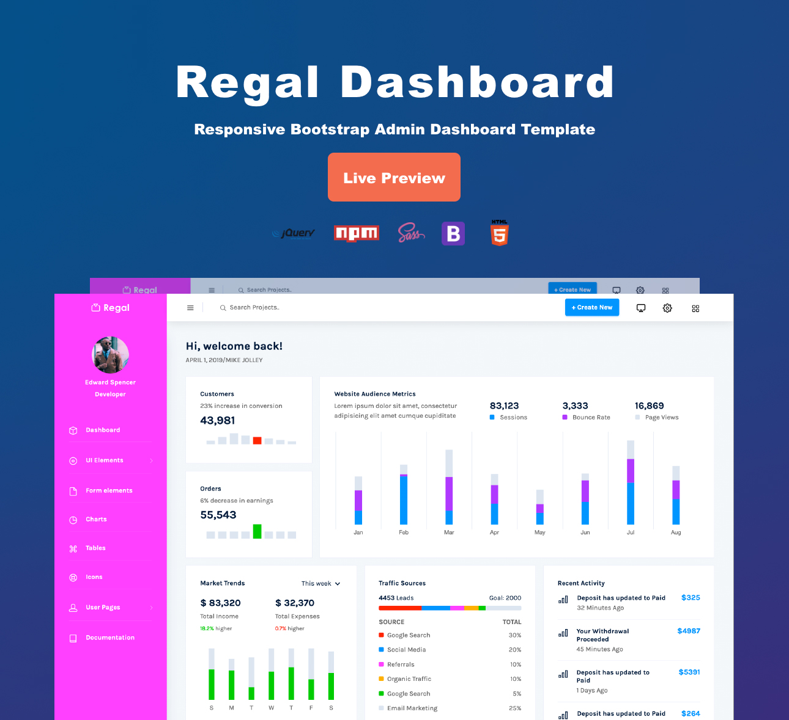

# Regal-Free-Bootstrap-Admin-Template

The free and responsive Regal Bootstrap admin template has an easy to comprehend code and detailed documentation. The template is incredible flexible and easy to customize, as SASS preprocessor is used for styling. The template is powered with the Bootstrap framework, jQuery, HTML, CSS, and SASS. It also comes with several page layouts, UI elements, tables, charts, and more components.

Check out the preview of Regal Admin template [here](http://www.bootstrapdash.com/demo/regal-free/template/index.html)

<h2>How to use</h2>

<ul>
  <li>
    Download or Clone the depositary
  </li>
  <li>
    Open the file template/index.html in a browser to view the demo
  </li>
  <li>
    Start editing the code as per your requirement
  </li>
  <li>
    If you wish to customize the template, use the command 'npm install' to install the necessary dependencies. Refer <a href="http://www.bootstrapdash.com/demo/regal-free/template/docs/documentation.html">documentaion</a> for more details on customization.
  </li>
</ul>